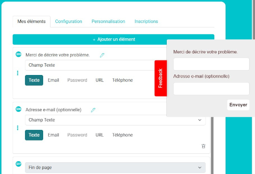
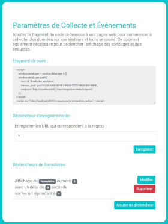
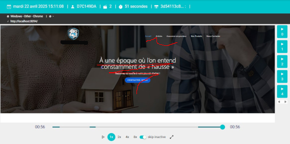
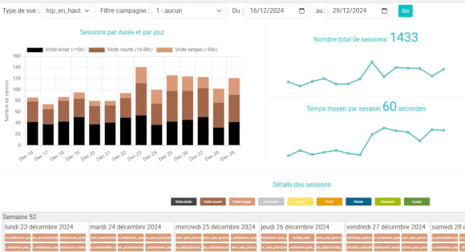

# FlowFinder

Cette page est aussi disponible en [français](README.fr.md)

FlowFinder is an open-source solution for recording user sessions and collecting feedback through survey forms. This self-hosted project helps analyze user behavior on websites and web apps.

Designed for both web developers and marketing teams, FlowFinder provides actionable insights to support A/B testing and Conversion Rate Optimization (CRO), making it a valuable tool for improving digital user experiences.

**Organization**: [FlowFinder.org](https://flowfinder.org)  
**GitHub**: [flowfinder-org/flowfinder](https://github.com/flowfinder-org/flowfinder)  
**License**: AGPL 3.0

## Important Warnings

- **Security**: The current authentication module is basic, with a default username/password set to `admin/admin`. Do not install it in production or make it publicly accessible without implementing more secure authentication.
- **GDPR Compliance**: This version is compliant with the GDPR.  
Visitors IP addresses are temporarily stored in plain text for geolocation purposes, and are **hashed before being displayed for the first time in the web interface**.
You can enable web session recording via RRWEB. In this case, **you are responsible for configuring RRWEB properly** to ensure that **no sensitive data is recorded**.
It is possible to enable or disable recording for specific pages using regular expressions, in the configuration section.  
By default, **session recording is disabled**.

## Prerequisites

- **PHP**: Version 8.2 or higher.
- **MariaDB/MySQL**: The database has been tested with MariaDB 10.6.
- **Required PHP Extensions**: PDO, mbstring, json, etc.
- **Web Server**: Apache with mod_rewrite enabled.

## Installation

[Detailed Installation guide](./INSTALL.md)

1. **Database**:  
   The database schema is provided in the file `/_database/db_schema.sql`. You can import it into your MariaDB or MySQL instance.

2. **Configuration**:  
   Modify the `Core/config.php` file to adjust database connection settings and the session file paths.

3. **Web Server**:  
   Set the `/public` folder as the root directory for Apache. The `index.php` file in this folder serves as the entry point to the application.

4. **Sessions and Recordings**:  
   User session recordings are managed through the integration of [rrweb](https://github.com/rrweb-io/rrweb), and the files are stored in the `/_USER_FILES_PRIVATE/` folder.

5. **Dependencies**:  
   This version uses Composer to manage dependencies like `ua-parser/uap-php`. Run `composer install` at the project root to download the required libraries.

## Project Structure

```
/Api -> API controllers 
/Controllers -> Web controllers (MVC)
/Core -> Configuration and core libraries (DB.php, config.php) 
/Helper -> Generic helper classes 
/Models -> Database models (PDO with manual mapping) 
/Views -> Views (using PHP as the template engine) 
/_database -> Database schema SQL 
/_USER_FILES_PRIVATE -> rrweb session files 
/vendor -> Composer libraries 
/public -> Public web files (htdocs) with .htaccess for mod_rewrite 
/public/resources -> Public resources (JS, CSS, IMG, JSON_EXEMPLE)
```

## Features

- **Session Replay**: User session recordings are done via the integration of `rrweb`. Session replays are accessible for detailed analysis.
- **Feedback/Survey Forms**: Collect user feedback through customizable forms. The survey configuration files can be found in `/public/resources/json_exemple`.
- **User Statistics**: Basic analytics including average session duration and user origin tracking, useful for A/B testing and digital marketing performance insights.
- **Self-hosting**: This project is designed to be self-hosted with a MariaDB/MySQL backend and an Apache server.

## Documentation

Full documentation is in progress. We will update this section once it is ready.

## Screenshots

Here are some screenshots to give you an overview of the application:

  
*Creation af survey and feedback forms made easy with live preview of the rendering similar to what will appears on the destination website*

  
*You can setup on which pages will be recorded and will display survey and feedbacks easily with simplified regexp*

  
*The web player permit to replay the sessions of the users visiting your web site so you can debug it or use it for UX analytics and CRO tasks*

  
*The stats are show realtime, you can filter by UTM tags and tags which permits to immediately sees when some specific events happens on your website, (eg: increase of views after a marketing campaign, decrease of sessions length due to a technical issue...)*

## Try the Hosted Version

If you want to explore FlowFinder without setting up a self-hosted instance, you can try our hosted cloud version available at [https://flowfinder.org](https://flowfinder.org).  
The free tier of the cloud version includes all the features of this open-source release, with the following limitations:

- **Rate Limiting**: Only a limited number of sessions can be recorded per minute. Not all sessions are guaranteed to be stored.
- **Data Retention**: Session data retention may vary depending on server availability and capacity.

This option is ideal for quick testing or small-scale usage without needing to configure a backend environment.

FlowFinder.org also offers professional Cloud versions and technical support services.

## How to Contribute

[See the contribution guide here](CONTRIBUTING.md).
It contains information on the project's priorities

## License

FlowFinder is licensed under the **AGPL 3.0** license. You can use, modify, and redistribute it, but you must also make your source code available under the same conditions.

